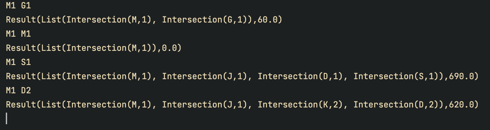

# Traffic Data Analytics - CLI

## Arguments:
- Src(FilePath/UrlPath), InterSection1(Source node), InterSection2 (Destination Node)
- InterSection1(Source node), InterSection2 (Destination Node) 

## Note:
Enter default path in `src/resource/application.conf`

## Sample:

